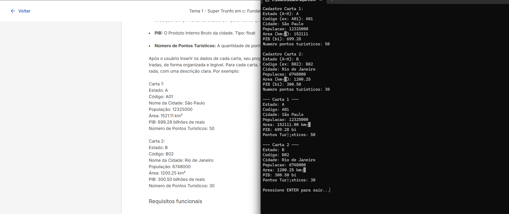

# Cadastro de Cartas de Cidades

Este programa em C permite o cadastro de duas "cartas" com informações sobre cidades brasileiras, como estado, código, nome, população, área, PIB e número de pontos turísticos.

Após o cadastro, o programa exibe todas as informações inseridas na tela.

## 📋 Informações que cada carta contém:

- Estado (letra entre A e H)
- Código da cidade (ex: A01, B02)
- Nome da cidade (pode conter espaços)
- População
- Área em km²
- PIB em bilhões
- Número de pontos turísticos

## 🖼️ Exemplo de execução

> Imagem do programa sendo executado com entrada de dados e exibição dos resultados.
